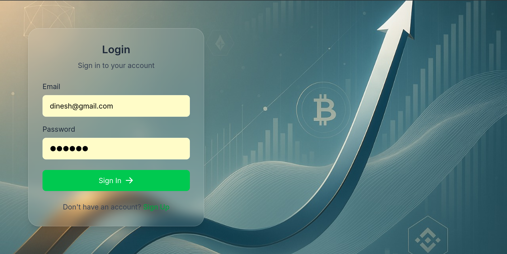
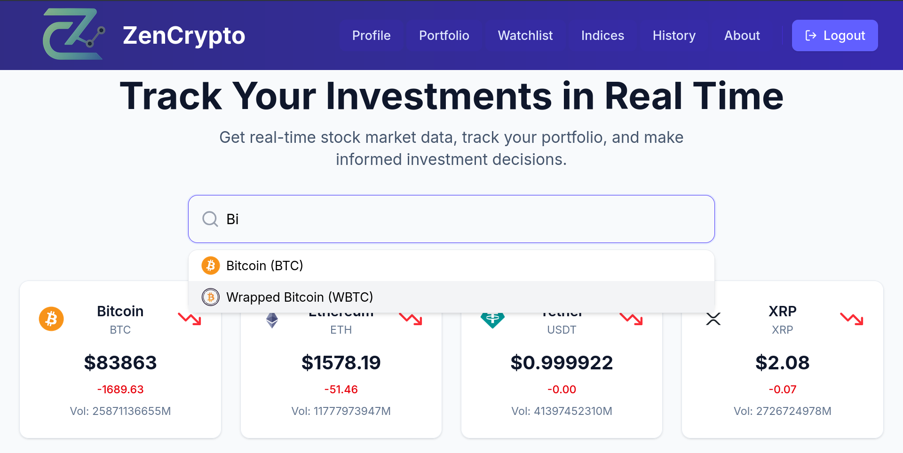
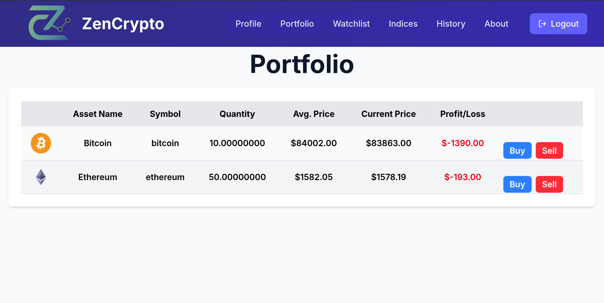
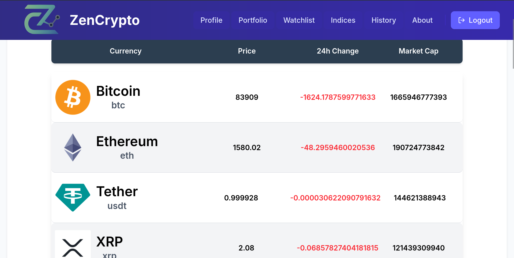
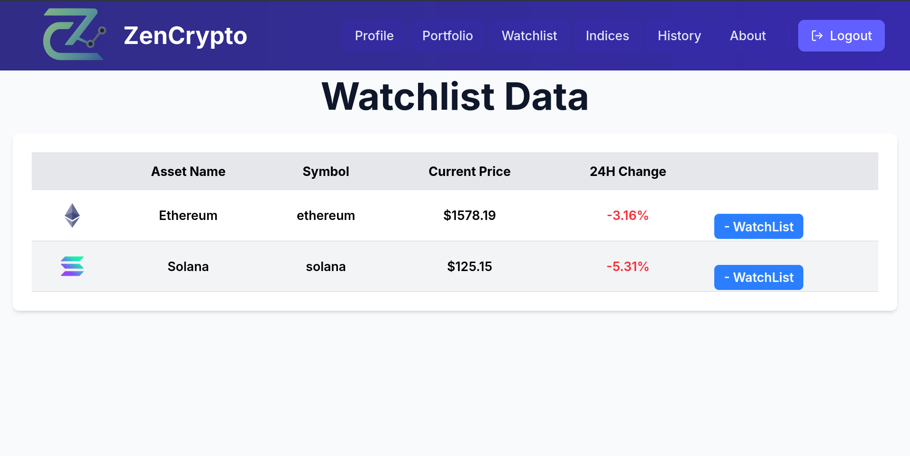
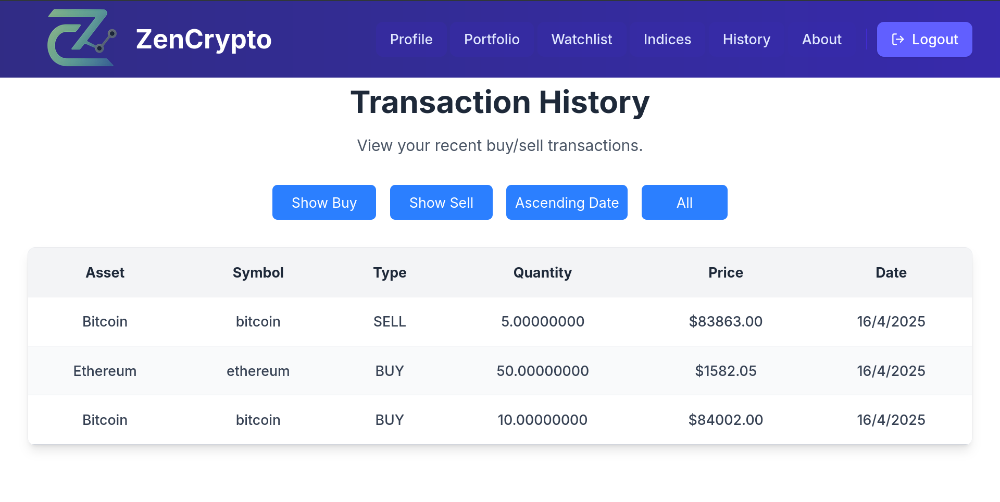
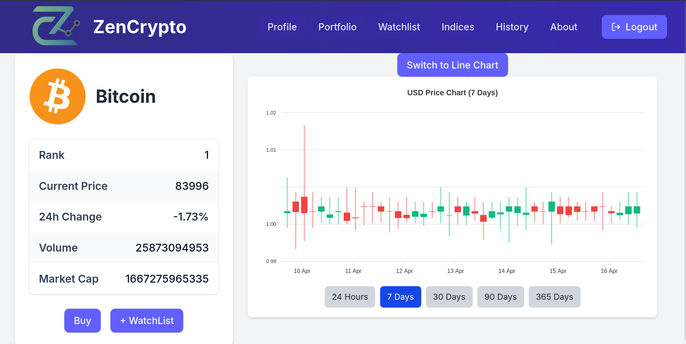
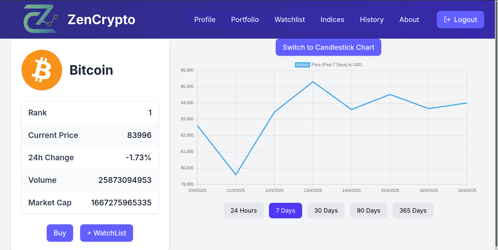
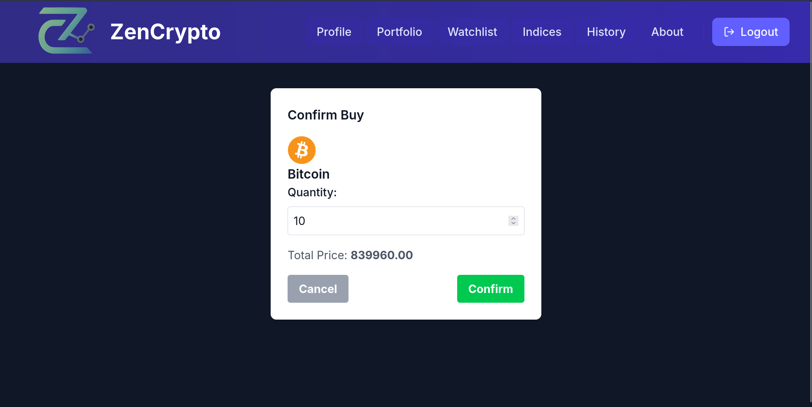
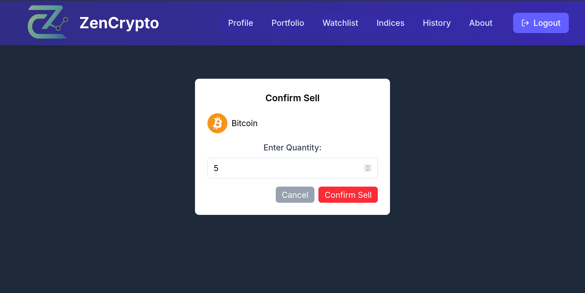

# 🧘‍♂ ZenCrypto – Real-Time Crypto Trading Simulator

*ZenCrypto* is a full-stack web application that simulates cryptocurrency trading, allowing users to practice and understand market dynamics without financial risk. Developed as a course project, it integrates real-time data, user authentication, and portfolio management to provide an immersive trading experience.

---

## 📖 Overview

Cryptocurrency trading can be daunting for beginners due to its volatility and complexity. *ZenCrypto* addresses this by providing a platform where users can:

- Simulate buying and selling of cryptocurrencies.
- Monitor portfolio performance in real-time.
- Gain insights into market trends without real financial exposure.

---

## ✨ Features

### 1. 🔐 Login Page  
  
Users can securely log in using their registered email and password.

### 2. 📝 Sign-Up Page  
  
Register new users with email, username, and secure password validation.

### 4. 🔍 Auto Search  
  
Easily search and filter cryptocurrencies using dynamic, real-time suggestions.

### 6. 📊 Portfolio  
  
Track your current crypto holdings and their market performance.

### 7. 📈 Indices  
  
Stay updated with major crypto market indices and global trends.

### 8. ⭐ Watchlist  
  
Add and remove favorite cryptocurrencies to a personalized watchlist for quick access.

### 9. 🧾 Transaction History  
  
Review your complete record of simulated buy/sell transactions.

### 10. 📉 Historical Data  
   
  
Analyze past performance and price trends of selected cryptocurrencies.

### 11. 💱 Buy & Sell  
 

Simulate cryptocurrency trading with real-time market prices.

---

## 🛠 Tech Stack

- *Frontend:* React.js  
- *Backend:* Node.js with Express  
- *Database:* MySQL (Clever Cloud)  
- *Authentication:* JSON Web Tokens (JWT)  
- *Hosting:* Vercel (Frontend), Railway (Backend)

---
